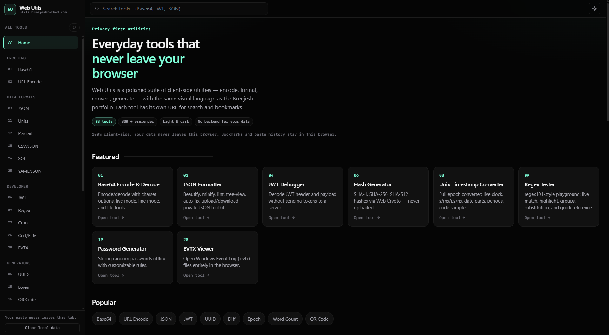
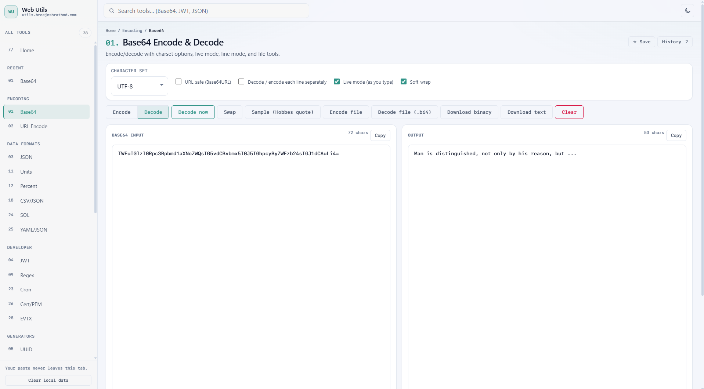
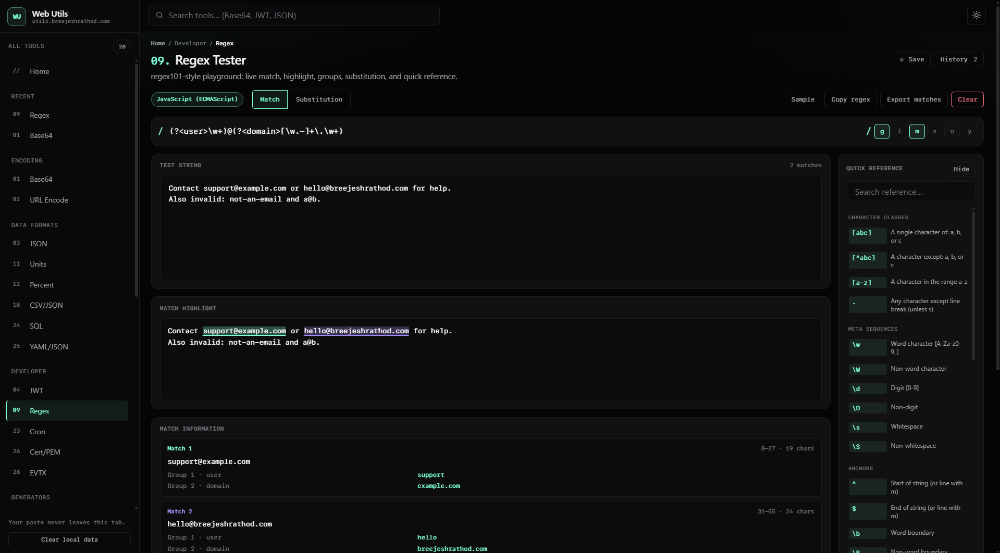

<p align="center">
  <picture>
    <source media="(prefers-color-scheme: dark)" srcset="doc-images/logo-dark.svg">
    <source media="(prefers-color-scheme: light)" srcset="doc-images/logo-light.svg">
    
  </picture>
</p>

<h1 align="center">Web Utils</h1>
<p align="center"><strong>Privacy-First, Client-Side Utility Suite for Everyday Developer & Life Tasks</strong></p>

<p align="center">
  <strong>A fast, sleek, 100% browser-local tool suite — zero backend, zero uploads.</strong><br>
  Encode, format, convert, analyze, and generate without sending a single byte of your data to external servers.<br>
  Live at <a href="https://utils.breejeshrathod.com/">utils.breejeshrathod.com</a>
</p>

<p align="center">
  
  
  
  
  
</p>

---

### Why Web Utils?

Most web utility tools (Base64 decoders, JSON formatters, JWT decoders, regex testers) force users to paste sensitive strings, proprietary logs, API tokens, or personal data into third-party websites. Many of these services silently upload your inputs to backend servers, log payloads, show intrusive advertisements, or require user registration.

**Web Utils is built as the privacy-focused alternative.** It is designed around four core pillars:

- **100% Client-Side & Privacy-First:** All processing, formatting, encoding, and parsing runs entirely in your browser using local JavaScript, Web Cryptography APIs, and Web Workers. Your data, pasted text, and uploaded files **never leave your device**.
- **28+ Essential Developer & Daily Tools:** A comprehensive collection covering Base64, JSON formatting & auto-fix, JWT decoding, Windows EVTX log parsing, Regex playgrounds, Unix timestamps, SQL beautification, Hash generation, and much more.
- **Blazing Fast Angular 19 + SSR Prerendering:** Every tool features its own SEO-optimized, deep-linkable URL (`/tools/{slug}`). Static prerendering delivers instant load times and full search engine indexability.
- **Zero Backend, Zero Logins & Zero Ads:** No user accounts, no tracking of payload content, no server-side APIs, and no ads. Just open the app and instantly complete your task.

---

### Screenshots & Preview

<p align="center">
  
  <br>
  <em>Web Utils Landing Page (Dark Theme) — Category Navigation, Instant Search, Dark/Light Theme System</em>
</p>

<br>

<p align="center">
  
  <br>
  <em>Base64 Encode & Decode Tool (Light Theme) — Charset Options, Live Mode, Per-Line & File Downloads</em>
</p>

<br>

<p align="center">
  
  <br>
  <em>Regex Tester & Debugger (Dark Theme) — Interactive Match Highlighting, Capture Groups, Substitution & Reference Guide</em>
</p>

---

### Suite of 28 Tools

Web Utils is organized into 8 intuitive categories:

#### 🔐 Encoding & Security
| Tool | Description | URL Path |
| :--- | :--- | :--- |
| **Base64 Encode & Decode** | Encode/decode with charsets, live mode, line-by-line, URL-safe mode & file download. | `/tools/base64-encode-decode` |
| **URL Encode & Decode** | Safely percent-encode or decode query parameters and URLs. | `/tools/url-encode-decode` |
| **Hash Generator** | Compute SHA-1, SHA-256, and SHA-512 hashes using browser Web Crypto APIs. | `/tools/hash-generator` |
| **Password Generator** | Generate strong, high-entropy passwords offline with customizable charset rules. | `/tools/password-generator` |

#### 📊 Data Formats & Conversion
| Tool | Description | URL Path |
| :--- | :--- | :--- |
| **JSON Formatter** | Beautify, minify, lint, view as tree, auto-fix errors, upload/download JSON locally. | `/tools/json-formatter` |
| **CSV ↔ JSON** | Convert CSV spreadsheet tables into JSON arrays and back. | `/tools/csv-json` |
| **YAML ↔ JSON** | Transform YAML configs to JSON objects and JSON back to YAML. | `/tools/yaml-json` |
| **SQL Formatter** | Beautify SQL queries with dialect support and customizable indentation. | `/tools/sql-formatter` |
| **Unit Converter** | Instant conversions for length, mass, temperature, and digital data storage sizes. | `/tools/unit-converter` |
| **Percentage Calculator** | Calculate discounts, tips, percentage change, and fractional values. | `/tools/percentage-calculator` |

#### 🛠️ Developer Tools
| Tool | Description | URL Path |
| :--- | :--- | :--- |
| **JWT Debugger** | Inspect JSON Web Token headers, payloads, and claims locally without sending tokens to a server. | `/tools/jwt-debugger` |
| **EVTX Viewer** | Open, parse, filter, and export Windows Event Log (`.evtx`) files entirely in-browser. | `/tools/evtx-viewer` |
| **Regex Tester** | Interactive JavaScript regex playground with live highlights, capture groups, and substitution. | `/tools/regex-tester` |
| **Cron Expression Explainer** | Translate cron expressions into plain human-readable English schedules. | `/tools/cron-explainer` |
| **Certificate Inspector** | Decode and inspect X.509 / PEM SSL certificates locally. | `/tools/certificate-inspector` |

#### 📝 Text & Documentation
| Tool | Description | URL Path |
| :--- | :--- | :--- |
| **Text Diff** | Side-by-side text comparison with highlighted additions and deletions. | `/tools/text-diff` |
| **Word & Character Counter** | Track words, characters, sentences, paragraphs, and reading time estimates. | `/tools/word-counter` |
| **Case Converter** | Convert text between `camelCase`, `snake_case`, `kebab-case`, `Title Case`, and UPPERCASE. | `/tools/case-converter` |
| **Markdown Preview** | Write Markdown with a live HTML preview and export options. | `/tools/markdown-preview` |

#### ⏳ Date & Time
| Tool | Description | URL Path |
| :--- | :--- | :--- |
| **Unix Timestamp Converter** | Live epoch clock, auto unit detection (`s`/`ms`/`µs`/`ns`), date parts, and code samples. | `/tools/timestamp-converter` |
| **Date Calculator** | Calculate age, duration between dates, and add/subtract days from specific dates. | `/tools/date-calculator` |

#### 🎨 Media & Utilities
| Tool | Description | URL Path |
| :--- | :--- | :--- |
| **Image Tools** | Convert images to Base64, resize dimensions, and compress quality using HTML Canvas. | `/tools/image-tools` |
| **EXIF Viewer & Stripper** | Inspect photo EXIF metadata and download cleaned copies free of location tags. | `/tools/exif-viewer` |
| **SVG Optimizer** | Minify SVG markup by stripping comments, metadata, and excess whitespace. | `/tools/svg-optimizer` |
| **Color Converter** | Convert HEX, RGB, HSL values and evaluate WCAG contrast ratios. | `/tools/color-converter` |

#### 🎲 Generators
| Tool | Description | URL Path |
| :--- | :--- | :--- |
| **UUID Generator** | Generate cryptographically secure UUID v4 and compact NanoIDs in bulk. | `/tools/uuid-generator` |
| **Lorem Ipsum Generator** | Generate placeholder text by word count, sentence count, or paragraph count. | `/tools/lorem-ipsum` |
| **QR Code Generator** | Create customizable QR codes for text/URLs and download high-res PNG images. | `/tools/qr-code-generator` |

---

### Tech Stack & Architecture

- **Framework:** [Angular 19](https://angular.dev/) (Standalone Components, Signals, Reactive Forms)
- **Rendering:** SSR (Server-Side Rendering) + Static Site Prerendering via `@angular/ssr`
- **Language:** TypeScript 5.7
- **Styling:** Vanilla SCSS design system (tokens aligned with `breejeshrathod-portfolio`, CSS custom properties, responsive grid layout)
- **Cryptography & Parsing:** Web Crypto API, `marked`, `js-yaml`, `sql-formatter`, `exifr`, `cronstrue`, `diff`, `qrcode`
- **Hosting & Infrastructure:** [Firebase Hosting](https://firebase.google.com/docs/hosting)

---

### Quick Start (Local Development)

#### Prerequisites
- Node.js 18.x or higher
- npm 9.x or higher

#### Installation & Running

```bash
# Clone the repository
git clone https://github.com/breejesh/web-utils.git
cd web-utils

# Install dependencies
npm install

# Start the Angular development server
npm start
```

Open your browser and navigate to `http://localhost:4200/`.

---

### Build & Deployment

#### Production Build (SSR + Prerender)

```bash
npm run build
```

This compiles:
- Static browser bundle & prerendered HTML routes: `dist/web-utils/browser`
- Node SSR server bundle: `dist/web-utils/server`

To test the SSR production bundle locally:

```bash
npm run serve:ssr:web-utils
```

#### Deploy to Firebase Hosting

```bash
# Build and deploy hosting target to Firebase
npm run ship
```

---

### Privacy & Data Guarantee

1. **Zero Payload Transmission:** All inputs, files, uploaded logs, and generated strings remain exclusively inside your browser tab's JavaScript runtime.
2. **Local Storage Only:** Optional feature history, bookmarks, and draft contents rely strictly on `window.localStorage`. You can clear all stored local data at any time via the sidebar button.
3. **Telemetry & Analytics:** If Firebase Analytics is configured, only page route views (`page_view`, `tool_open`) are recorded for basic usage statistics. **Payload contents, search queries, pasted text, and uploaded files are never logged or stored.**

---

### License & Author

Crafted with ❤️ by **[Breejesh Rathod](https://breejeshrathod.com)**

Distributed under the **MIT License**. See `LICENSE` for more information.
